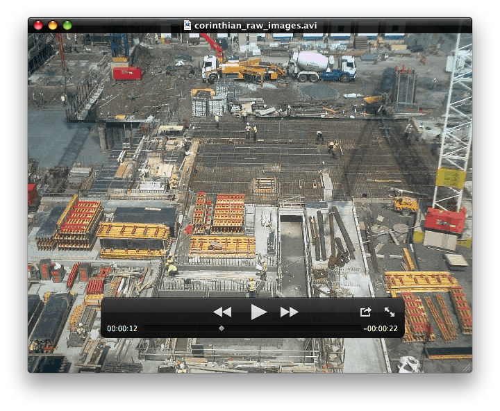
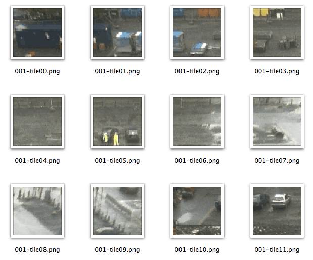
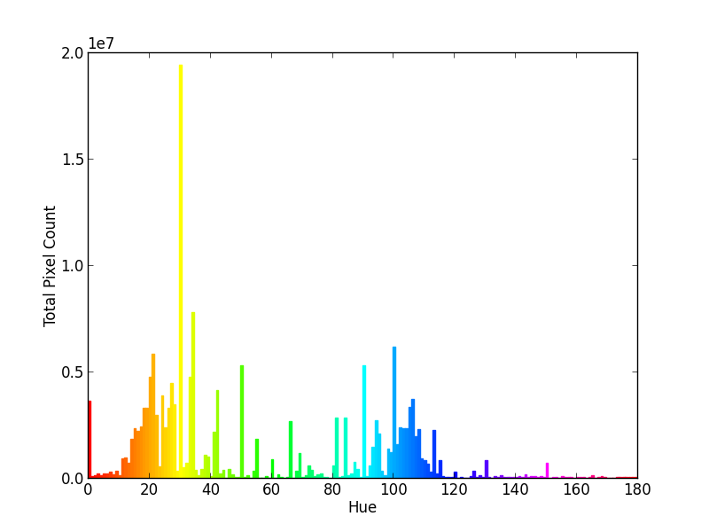

Pixelmòr
=========

"Big Pixel Data" with Hadoop/Python/OpenCV

This is an article written to try and understand the current state-of-the-art in large scale image/video processing. It forms a set of tutorials that will perhaps help (or inspire) others, or maybe even grow into something more... 

I'll start with the simplest case of what we can achieve with an established toolset - namely some Hadoop and a bit of OpenCV/Python. If you simply want to leverage an existing framework to grind image/video data, well, here's how.

However, this rather more importantly shows up just what is deficient in such an approach. Particularly in the unique nature of problems presented by image/video data, and the end use-cases for it. Naturally the question emerges as to what would be a more principled way to process and analyse massive amounts of pixels (rather than characters)?

This all assumes a certain familiarity with Hadoop based technologies, pythong and a fair smattering of computer vision. I myself am by not means an expert - even though these notes stem from a presentation I did some while ago [here](present/anc09_cloudy_vision.pdf). The intention however is to be *pragmatic* rather than overly too bogged down in theory - except when it matters!

Colour Count
------------

Let's see how we can emulate the stock "word-count"of vanilla *text-based* map-reduce - but instead do a "colour-count" across all the pixels in the video.

We can achieve this, and allow scalability, by splitting up the input video into frames, and furthermore each frame into a set of tiles. Then, we can combine all these tiles into a ["SequenceFile"](http://hadoop.apache.org/docs/current/api/org/apache/hadoop/io/SequenceFile.html) - one of the handier container formats that Hadoop supports for processing lots of smaller files.

I should add at this point that there is indeed a project that extends Hadoop for processing image data: [Hipi](http://hipi.cs.virginia.edu/). This has developed some appealing concepts to support image data transfer and culling, but unfortunately, it is rather languishing in limbo. We also desire more fine grained control over the image data - especially video data - beyond that offered by Hipi's ImageBundle file.

Furthermore, Hipi is still Java based, and we would prefer to use *python* as our language of choice - mainly for it's conciseness, but also to exploit its support for numerical and computer vision package bindings (e.g. OpenCV).

To keep things simple, we can process the data following the paradigm of [Hadoop Streaming](http://hadoop.apache.org/docs/mapreduce/current/streaming.html). To achieve this, and enable effective invocation of OpenCV we use the "Dumbo" python module, effectively a wrapper around the job invocation to let us execute python code, but which also - crucially - allows the python job to access the typed bytes that encode the image data to be processed.

Again, it should be noted there is a more full fledged python solution to low-level Hadoop programming using [PyDoop](http://pydoop.sourceforge.net/docs/index.html) which provides a map-reduce and HDFS API for object-orientated programming. This is extremely useful, but somewhat over-kill in this initial example. We'll come back to it later.

The rest of the article is thus structured as a complete walk through of how to combine the simplest core technologies (sequence files, Hadoop streaming, python, opencv) into a working example of video processing.

### Environment

What you will need for this (with versions at the time of writing):

* Python - version 2.7.2
* Hadoop (needs Java of course) - version 1.1.1
* FFmpeg - version 1.0.1
* ImageMagick - version 6.8.0
* Opencv - version 2.4.2
* Numpy - version 1.6.2
* matplotlib - version 1.2.0
* ipython - version 0.13.1
* dumbo - version 0.21.35

Technically, this is entirely possible on any platform, but you will need Java for Hadoop!

For simplicity I am going to use MacOS in this tutorial, with everything else pulled in via the Homebrew 'brew' command. Thus, the following list of commands gets everything (although subsequent brew update's might get later versions):
```
	> brew update
	> brew install ffmpeg
	> brew install imagemagick
	> brew install hadoop
	> brew install python
	> brew install opencv
```
Note that we build python and opencv in this manner (and order) so that the correct bindings are compiled.

At this point I feel obligied to mention the virtues of the python `virtualenv` package. Before going any further I would recommend installing and understanding how it will enable us to isolate a particular set of packages.  For any further troubles, there is sound advice here - especially the bit about removing and relinking the old python Frameworks directory: [Installing python, numpy, matplotlib and ipython on lion](http://www.thisisthegreenroom.com/2011/installing-python-numpy-scipy-matplotlib-and-ipython-on-lion/).

So, having read that, here we go...

Python's numerical libraries - numpy - for which we need to use the 'pip' command to install:
```
	> pip install numpy
```
It's also very handy (as ever) to have ipython installed (along with matplotlib for visualisation):
```
	> pip install matplotlib
	> pip install ipython
```
Now, fundamentally, we are going to use [dumbo](https://github.com/klbostee/dumbo/) to allow us to nicely run python code over Hadoop.

Installed with:
```
	> pip install dumbo
```
_N.B._ I had to do the wee fix documented at the very end of this post here (to append `file://` to the modpath at line 80 of `/usr/local/lib/python2.7/site-packages/dumbo/backends/streaming.py`). See [here](https://github.com/klbostee/dumbo/issues/28).

Make sure your python path is up to date (e.g. includes /usr/local/lib/python2.7/site-packages). You may encounter problems later which can be fixed by updating the paths where the Hadoop jobs will look via:
```
	/usr/local/opt/hadoop/libexec/conf/hadoop-env.sh
```
With entries such as:
```
	export PATH="/usr/local/bin:/usr/local/share/python:$PATH"
	export PYTHONPATH="/usr/local/lib/python2.7/site-packages/":$PYTHONPATH
```

### Data Split and Load

As an example, let's use a freely available video constructed form a sequence captured via a construction-site web-cam (part of a previous project I helped set up at the University of Edinburgh).

	http://homepages.inf.ed.ac.uk/rbf/TIMELAPSEVIDEOS/

Let's download one of the unmodified videos under the "Traditional Approach" - for example the "Corinthian" camera .AVI format video of 532 frames.

 

We can then use ffmpeg to first split the video into a folder called frames. We then further split those into 64x64 images tiles (stored in a similarly named directory), before combining all of the individual tiles into a single data.tar file using this handy *tar-to-seq* command which may be downloaded from here, unpacked, and placed somewhere ready for Java to run - (Download tar-to-seq)[http://stuartsierra.com/2008/04/24/a-million-little-files]

This will result in 42560 tiles and a sequence file of 214MB, so may take a while…

```
	> mkdir frames
	> ffmpeg -i corinthian_raw_images.avi -f image2 frames/frame-%3d.png
	> mkdir tiles
	> for file in frames/*.png; do convert -crop 64x64 +repage $file tiles/`basename $file .png`-tile%02d.png; done
	> tar -cvf data.tar tiles/
	> java -jar tar-to-seq.jar data.tar input.seq
```

NOTE: *make sure there is no hidden folder created within tiles - e.g. a .DS_STORE on MacOS when you go and look at the contents!* You don't want these included in the sequence file!

The resulting tiles look like this:

 

Now the data is ready to be loaded into Hadoop.

This assumes you have Hadoop all set-up and are at least reasonably familiar with its operation. In the example below I assume a pseudo-distributed mode - to simulate the distributed nature of the task. You can, of course, set up a true multi-node environment as well if you have the machines/instances (and see your throughput go through the roof)...

For the pseudo-distributed set-up, simply [follow](http://hadoop.apache.org/docs/r1.1.1/single_node_setup.html#PseudoDistributed).

Edit the necessary core-site.xml, hdfs-site.xml and mapred-site.xml in the configuration directory of Hadoop, which (if using brew) can be found under: `/usr/local/opt/hadoop/libexec/conf`. (Note that on MacOS you may have to also enable Remote Login via the Sharing control panel to allow ssh to work).

Now, format the filesystem with a:
```
	> hadoop namenode -format 
```
Followed by a:
```
	> start-all.sh 
```
to start Hadoop. You can can then view the progress of jobs by going to http://localhost:50030/ and can stop with:
```
	> stop-all.sh
```
We are then in a position to copy our sequence file from local into the hdfs filesystem:
```
	> hadoop dfs -copyFromLocal input.seq /data/input.seq
```
And can verify it is there:
```
	> hadoop dfs -ls /data

	Found 1 items
	-rw-r--r--   1 tlukins supergroup  224506763 2013-01-09 17:21 /data/input.seq
```

### Data Map & Reduce

Dumbo supports sequence files. And it incorporates the 'typedbytes' library which allows us to handle the raw pixel byte values in the sequence file. There is a short tutorial on it [here](https://github.com/klbostee/dumbo/wiki/Short-tutorial).

We can then use the following python code to define our map() and reduce() functions. The map() function simply converts the typedbytes into decoded image data, extracts the hue component of each pixel, then performs a binning operation for each possible value of hue (0-180 degrees in the case of OpenCV 8U images). The reduce function only need to sum the results for each key (hue).

```python
import cv 
import cv2
import numpy as np 

def mapper(key, value):
  # Read in the data and decode...
  imgbytes = np.fromstring(value,dtype='uint8') 
  imarr = cv2.imdecode(imgbytes,cv2.CV_LOAD_IMAGE_COLOR) 
  im = cv.fromarray(imarr) 
  # Convert and split data to get hue... 
  hsv = cv.CreateImage(cv.GetSize(im),8,3)
  hue = cv.CreateImage(cv.GetSize(im),8,1)
  cv.CvtColor(im,hsv,cv.CV_BGR2HSV)
  cv.Split(hsv, hue, None, None, None)
  # Calculate colour (hue) histogram...
  hue_bins = 180 
  hue_range = [0,180] # nb. opencv hue range
  hist = cv.CreateHist([hue_bins], cv.CV_HIST_ARRAY, [hue_range], 1) 
  cv.CalcHist([hue],hist,0,None)
  # Yeild count of colour... 
  for h in range(hue_bins):
    yield int(h),cv.QueryHistValue_1D(hist,h) 

def reducer(key, values):
  # Simply sum up the values per colour...
  yield key,sum(values)

if __name__ == "__main__":
  import dumbo
  dumbo.run(mapper, reducer, combiner=reducer)
```

Now, finally, we can run our job on the data in the sequence file…
```
	> /usr/local/share/python/dumbo start countcolour.py -hadoop /usr/local/opt/hadoop -hadooplib /usr/local/opt/hadoop/libexec -input /data/input.seq -output colours -inputformat sequencefile -outputformat text
```
If you get errors, look at the logs:
```
	/usr/local/Cellar/hadoop/1.1.1/libexec/logs/userlogs/[JOB REF]/[ATTEMPT]/
```
Like as not it will be something with the python import. 

Check the result was output
```
	> hadoop dfs -ls colours/
```
And download it from the hdfs filesystem with:
```
	> hadoop dfs -cat colours/part-00000 | less > colours.txt
```
Finally, if you need to remove it from the filesystem (especially if you want to run it again) do:
```
	> hadoop dfs -rmr colours
```

### Data Visualisation

Now to visualise the results as a colour histogram *for the entire video*:

```python
import numpy as np 
import matplotlib.pyplot as plt
from matplotlib.colors import hsv_to_rgb

data = np.genfromtxt(open("colours.txt","rb"),delimiter="\t")
hue = data[:,0]
count = data[:,1]
hsv = np.dstack((hue/180.0,np.ones(180),np.ones(180)))
rgb = hsv_to_rgb(hsv)
colours=['#%02x%02x%02x' % tuple(c*255) for c in rgb[0]]

plt.bar(hue,count,color=colours,edgecolor=colours)
plt.xlim(0,180)
plt.xlabel('Hue')
plt.ylabel('Total Pixel Count')
plt.show()
```

This loads the data from our output above (in "colours.txt") and plots them as a histogram. A nice touch is to use the hsv_to_rgb function to actually render these colours as well for each respective bin.

 

What can we tell from this? Well, it would seem there is a predominance of yellow pixels throughout the video. This should come as no great surprise given the nature of construction sites where equipment, materials and workers are often brightly coloured. Although, the amount of muddy yellow colours in the ground and cladding would also contribute to this.

Taking this further we could model the distribution centred around the yellow peak - and so try and extract regions of highly coloured yellow as a sign to the presence in the scene of equipment or people. The problem then is how to determine if such pixels belong to the same coloured object (i.e. are spatial neighbours) and at what level there is a sufficient number of them to be deemed significant, given the true scale of the object in question.

#### Conclusion

With these first steps we have performed the simplest form of distributed processing on a video using a combination of pure Hadoop streaming, python and OpenCV.

We have shown how this is relatively straightforward, once the input video data has been subdivided into units of work using FFMpeg and stored in a sequence file. This is something of a ponderous first-step, which could be more neatly addressed by another stage of map jobs to split/combine video files loaded directly onto the HDFS filesystem.

The following processing of the image bytes is likewise straightforward, but in retrospect there is some significant loss of information with regards to *where* this data was located in the original file (e.g. the timestamp). Such information is recoverable - from the key value of the original filename used in the sequence file - but the fact remains, we manage to lose the spatial and temporal index of the pixel within the wider context of the scene…

This is fine for processing occurring at the level of the individual, anonymised pixel - but for any "real" visual processing we would ideally be able to aggregate information to resolve higher level structure and properties of the scene.

Furthermore, we have no inherent representation of scale. Indeed the size of the tiles we create (64x64) is arbitrary and can have a huge bearing on later high-level processing. More recent, hierarchical models for image features extraction look to move (quite literally) beyond global "bags of features" to holistic pyramidal/scale-space representations.

Finally, our attempt to then "do something" with the result of the data proves rather contrived. If anything, we have done the "Big Data" part, but not the "Data Science" to offer up true insight and value (although it is a nice example of a colour histogram!). Many of the difficult high-level tasks attempted from video data: object recognition, segmentation, 3D reconstruction, etc. are not really catered for in this (or any existing) framework, and would still required a great deal of effort to develop from the bottom-up.

This is then then overarching theme for further investigation in the next section...

